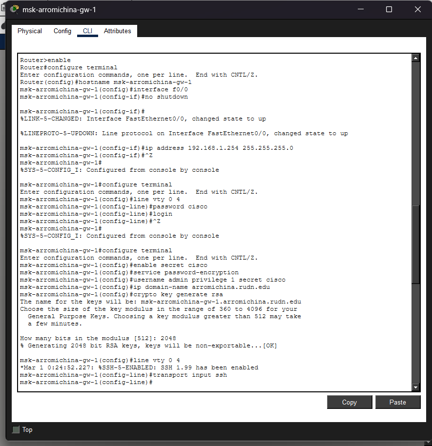
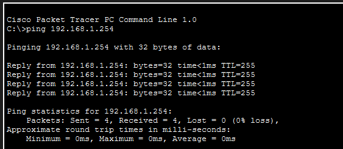
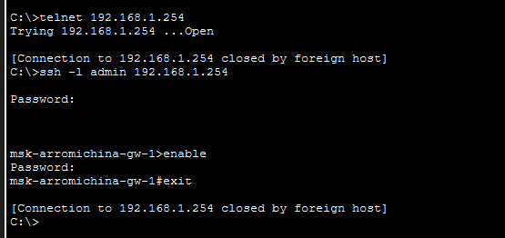

---
## Front matter
lang: ru-RU
title: Лабораторная работа 2
subtitle: Предварительная настройка оборудования Cisco
author:
  - Ромицына А.Р.
institute:
  - Российский университет дружбы народов, Москва, Россия

## i18n babel
babel-lang: russian
babel-otherlangs: english

## Formatting pdf
toc: false
toc-title: Содержание
slide_level: 2
aspectratio: 169
section-titles: true
theme: metropolis
header-includes:
 - \metroset{progressbar=frametitle,sectionpage=progressbar,numbering=fraction}
 - '\makeatletter'
 - '\beamer@ignorenonframefalse'
 - '\makeatother'
 
## Fonts
mainfont: PT Serif
romanfont: PT Serif
sansfont: PT Sans
monofont: PT Mono
mainfontoptions: Ligatures=TeX
romanfontoptions: Ligatures=TeX
sansfontoptions: Ligatures=TeX,Scale=MatchLowercase
monofontoptions: Scale=MatchLowercase,Scale=0.9
---

# Информация

## Докладчик

:::::::::::::: {.columns align=center}
::: {.column width="70%"}

  * Ромицына Анастасия Романовна
  * Российский университет дружбы народов
  * [1132236132@rudn.ru](mailto:1132236132@rudn.ru)

:::
::: {.column width="30%"}

:::
::::::::::::::

## Цель работы

Получить основные навыки по начальному конфигурированию оборудования
Cisco.

# Выполнение лабораторной работы

## Рабочая область

{#fig:001 width=30%}

## Настройка маршрутизатора

{#fig:002 width=30%}

## Настройка коммутатора

{#fig:003 width=30%}

## ping маршрутизатора

{#fig:004 width=70%}

## ping коммутатора

{#fig:005 width=70%}

## Проверка подключения разными способами к маршрутизатору

{#fig:006 width=70%}

## Проверка подключения разными способами к коммутатору

{#fig:007 width=70%}
# Выводы
Мы смогли получить основные навыки по начальному конфигурированию оборудования
Cisco.
:::

