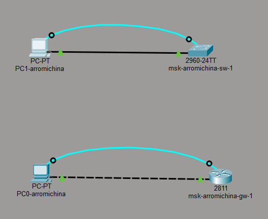
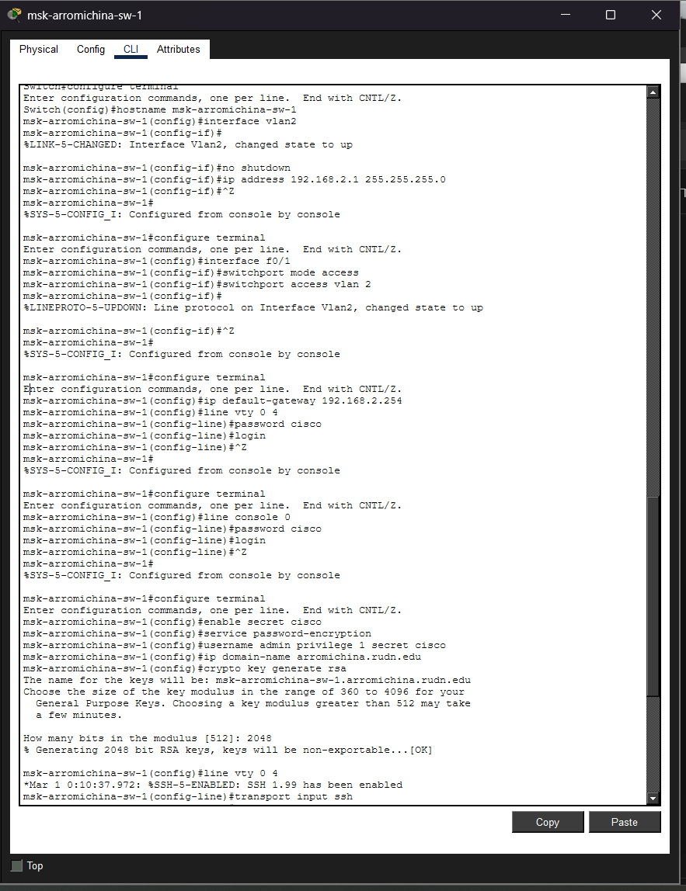
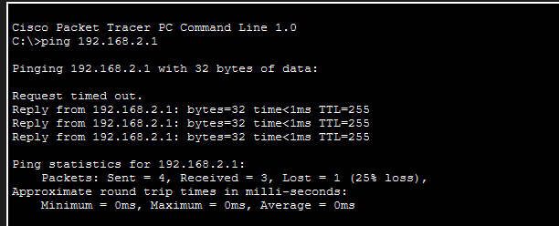
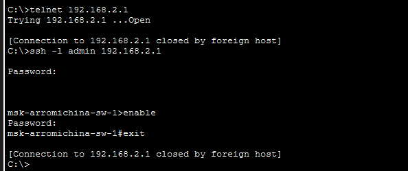

---
## Front matter
title: "Лабораторная работа 2"
subtitle: "Предварительная настройка оборудования Cisco"
author: "Ромицына Анасасия Романовна"

## Generic otions
lang: ru-RU
toc-title: "Содержание"

## Bibliography
bibliography: bib/cite.bib
csl: pandoc/csl/gost-r-7-0-5-2008-numeric.csl

## Pdf output format
toc: true # Table of contents
toc-depth: 2
lof: true # List of figures
lot: true # List of tables
fontsize: 12pt
linestretch: 1.5
papersize: a4
documentclass: scrreprt
## I18n polyglossia
polyglossia-lang:
  name: russian
  options:
	- spelling=modern
	- babelshorthands=true
polyglossia-otherlangs:
  name: english
## I18n babel
babel-lang: russian
babel-otherlangs: english
## Fonts
mainfont: PT Serif
romanfont: PT Serif
sansfont: PT Sans
monofont: PT Mono
mainfontoptions: Ligatures=TeX
romanfontoptions: Ligatures=TeX
sansfontoptions: Ligatures=TeX,Scale=MatchLowercase
monofontoptions: Scale=MatchLowercase,Scale=0.9
## Biblatex
biblatex: true
biblio-style: "gost-numeric"
biblatexoptions:
  - parentracker=true
  - backend=biber
  - hyperref=auto
  - language=auto
  - autolang=other*
  - citestyle=gost-numeric
## Pandoc-crossref LaTeX customization
figureTitle: "Рис."
tableTitle: "Таблица"
listingTitle: "Листинг"
lofTitle: "Список иллюстраций"
lotTitle: "Список таблиц"
lolTitle: "Листинги"
## Misc options
indent: true
header-includes:
  - \usepackage{indentfirst}
  - \usepackage{float} # keep figures where there are in the text
  - \floatplacement{figure}{H} # keep figures where there are in the text
---

# Цель работы

Получить основные навыки по начальному конфигурированию оборудования
Cisco.

# Выполнение лабораторной работы

В логической рабочей области Packet Tracer разместим коммутатор,
маршрутизатор и 2 оконечных устройства типа PC, соединим один PC
с маршрутизатором, другой PC — с коммутатором(рис. [-@fig:001]).

{#fig:001 width=70%}

Проведем настройку маршрутизатора в соответствии с заданием, ориентируясь на приведённую ниже часть конфигурации маршрутизатора(рис. [-@fig:002]).

{#fig:002 width=70%}

Проведем настройку коммутатора в соответствии с заданием, ориентируясь на приведённую ниже часть конфигурации коммутатора(рис. [-@fig:003]).

{#fig:003 width=70%}

Проверим работоспособность соединений с помощью команды ping для маршрутизатора.(рис. [-@fig:004]).

{#fig:004 width=70%}

Проверим работоспособность соединений с помощью команды ping для коммутатора.(рис. [-@fig:005]).

{#fig:005 width=70%}

Попробуем подключиться к маршрутизатору разными способами: с помощью консольного кабеля, по протоколу удалённого доступа
(telnet, ssh)(рис. [-@fig:006]).

{#fig:006 width=70%}

Попробуем подключиться к коммутатору разными способами: с помощью консольного кабеля, по протоколу удалённого доступа
(telnet, ssh)(рис. [-@fig:007]).

{#fig:007 width=70%}

# Выводы
Мы смогли получить основные навыки по начальному конфигурированию оборудования
Cisco.

# Ответы на контрольные вопросы:

1 Возможные способы подключения к сетевому оборудованию:
Подключение к сетевому оборудованию возможно двумя основными способами. Первый способ — это подключение через консольный порт с использованием консольного кабеля, который подключается напрямую к компьютеру. Этот способ используется для первоначальной настройки оборудования, когда сетевое подключение еще не настроено или недоступно. Второй способ — удаленное подключение по сети через протоколы Telnet или SSH после того, как устройству назначен IP-адрес.

2 Каким типом сетевого кабеля следует подключать оконечное оборудование пользователя к маршрутизатору и почему:
Оконечное оборудование пользователя к маршрутизатору следует подключать перекрестным кабелем. Это объясняется тем, что и компьютер пользователя, и маршрутизатор относятся к типу оборудования DTE. При соединении двух устройств одного типа необходимо перекрестить пары проводов, чтобы сигнал передачи одного устройства попадал на прием другого.

3 Каким типом сетевого кабеля следует подключать оконечное оборудование пользователя к коммутатору и почему:
Оконечное оборудование пользователя к коммутатору следует подключать прямым кабелем. Коммутатор относится к типу оборудования DCE, а компьютер пользователя относится к типу DTE. При соединении устройств разного типа используется прямой кабель, так как назначение пар проводов уже соответствует необходимым цепям приема и передачи.

4 Каким типом сетевого кабеля следует подключать коммутатор к коммутатору и почему:
Коммутатор к коммутатору следует подключать перекрестным кабелем. Оба устройства являются коммутаторами и относятся к одному типу оборудования DCE. Для корректной работы необходимо перекрестить пары проводов, чтобы передача первого коммутатора попадала на прием второго, и наоборот. Современное оборудование поддерживает функцию Auto-MDIX, которая автоматически определяет тип кабеля, однако теоретически правильным является использование перекрестного кабеля.

5 Укажите возможные способы настройки доступа к сетевому оборудованию по паролю:
Настройка доступа к сетевому оборудованию по паролю осуществляется несколькими способами. Устанавливается пароль на консольный порт для защиты локального доступа. Устанавливается пароль на виртуальные терминальные линии VTY для защиты удаленного доступа. Устанавливается пароль на привилегированный режим с помощью команд enable password или enable secret, причем второй способ предпочтительнее, так как пароль хранится в зашифрованном виде. Также существует команда service password-encryption, которая шифрует все открытые пароли в конфигурационном файле.

6 Укажите возможные способы настройки удалённого доступа к сетевому оборудованию. Какой из способов предпочтительнее и почему:
Возможными способами настройки удаленного доступа к сетевому оборудованию являются протокол Telnet и протокол SSH. Предпочтительным способом является протокол SSH. Это объясняется тем, что SSH обеспечивает шифрование всей передаваемой информации, включая логины и пароли, что защищает данные от перехвата и несанкционированного доступа. Telnet передает все данные в открытом виде и является уязвимым для атак, поэтому в современных сетях рекомендуется использовать только SSH.

# Список литературы{.unnumbered}

::: {#refs}
:::
